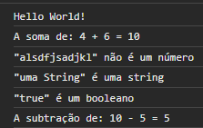

<h1 align="center"> Getting Started with JavaScript </h1>

  <a href="#-technologies">Technologies</a>&nbsp;&nbsp;&nbsp;|&nbsp;&nbsp;&nbsp;
  <a href="#-project">Project</a>&nbsp;&nbsp;&nbsp;|&nbsp;&nbsp;&nbsp;

 

  

## 🚀 Technologies

This project was developed with the following technologies:

- HTML
- Javascript
- Git and GitHub

## 💻 Project

- [Access the finished project, online](https://aoba43.github.io/Intensivao4_exercise2/)

- Project given by Rocketseat to get started with Javascript
